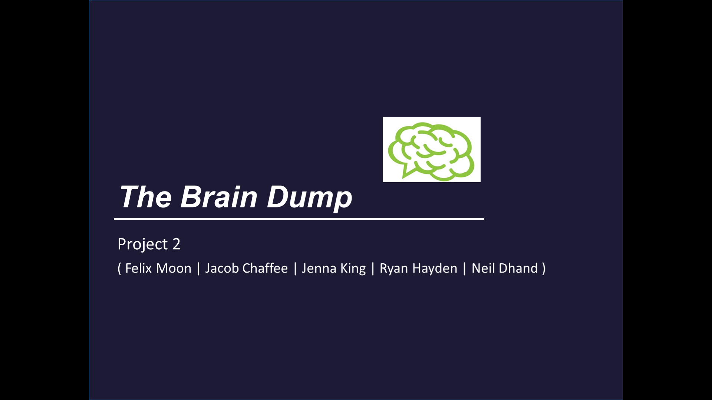
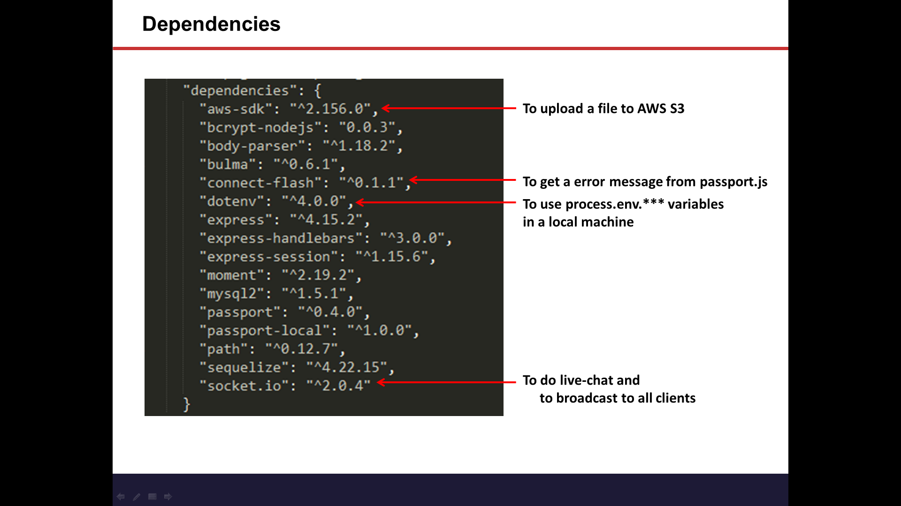
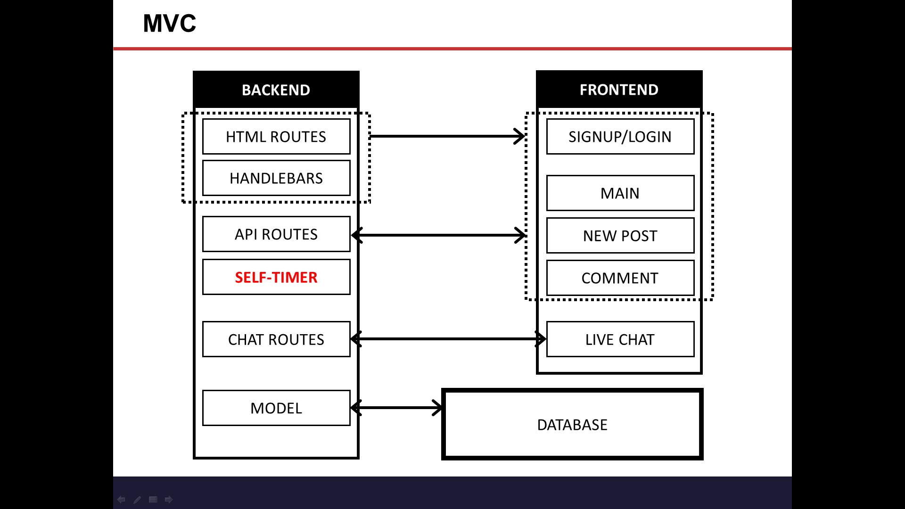
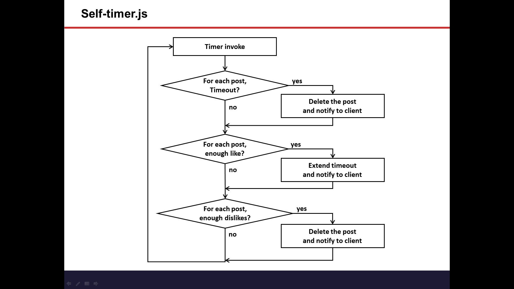

# The Brain Dump

### Overview

This is a social media app, inspired by the likes of Facebook, Instagram, Reddit and so on. Within the app, user is prompted to register. Log-in information is saved to a database via MongoDB. Using Node/Express, based on user inputs, data is saved, updated and/or deleted, and routed to the appropriate pages. The main page comprompise of the 'timeline screen' where users can post ideas, pictures or other files that they wish to share on the Internet. The catch? The post disappears after 24 hours unless the user has accumlate enough likes - the post lives on - or dislikes - the post then disappers.

### Tools Used
Bulma Framework
HTML/CSS/Javascript/JQuery
Node/Express
MongoDB

### Team

* Ryan Hayden: Lead, Frontend
* Neil Dhand: Backend
* Felix Moon: Backend / Merging Code
* Jacob Chaffee: Frontend 
* Jenna King: Frontend / Backend / Troubleshoot

### URL Link
https://the-brain-dump.herokuapp.com/

